 

---

## 👋 About

Full-stack web developer and B.E. Information Technology student who designs, builds and ships complete products. I work across the stack, from interactive React and JavaScript frontends to Python and SQL backends with REST APIs, and I focus on turning ideas into polished, usable software.

## 🚀 Featured projects

<table>
  <tr>
    <td width="50%" valign="top">
      <h3>💸 Bublops: SaaS Investor &amp; Borrower Analytics</h3>
      A full-stack platform where investors manage borrowers, loan amounts and goal milestones from one dashboard. Real-time analytics compute capital invested, yield, balances and due dates, plus a one-click WhatsApp Nudge that sends payment reminders with the exact due amount.
      

        
        
        
      

      
    </td>
    <td width="50%" valign="top">
      <h3>🎬 CodeToAnim: Interactive Python Code Visualizer</h3>
      A web app that animates algorithm execution step by step, such as array changes in binary search and sorting, so learners can see what each line does. Includes play, pause and step-forward controls to inspect data-structure state at every step.
      

        
        
        
      

      
    </td>
  </tr>
</table>

## ⚡ Technical skills

<table>
  <tr><td><b>Languages</b></td><td>JavaScript (ES6+), Python, SQL, HTML5, CSS3</td></tr>
  <tr><td><b>Frontend</b></td><td>React.js, Responsive Design, Reusable UI Components, DOM Manipulation, HTML5 Canvas</td></tr>
  <tr><td><b>Backend &amp; Data</b></td><td>Flask, FastAPI, RESTful APIs, MySQL, SQLite, WhatsApp API Integration</td></tr>
  <tr><td><b>Tools</b></td><td>Git, GitHub, VS Code, Web Analytics, Data Visualization</td></tr>
</table>

  

## 📊 GitHub stats

  
  

  

## 📫 Let's connect

  
  
  

  

